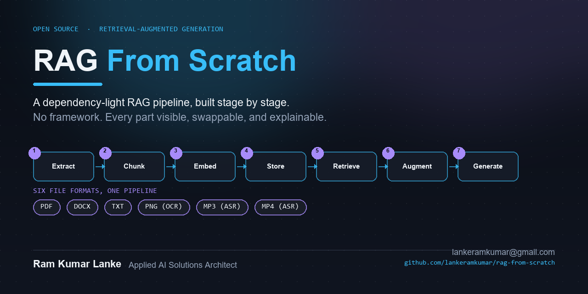

# RAG From Scratch



[](LICENSE)
[](https://www.python.org/)
[](https://lankeramkumar.github.io/rag-from-scratch/)
[](https://www.youtube.com/shorts/qmQqMsMJWXE)
[](https://github.com/lankeramkumar/rag-from-scratch/stargazers)

**A dependency-light Retrieval-Augmented Generation pipeline, built stage by stage — no LangChain, no black-box framework, every part visible and swappable.**

**Ram Kumar Lanke** — Applied AI Solutions Architect
[lankeramkumar@gmail.com](mailto:lankeramkumar@gmail.com)

**[Live interactive demo](https://lankeramkumar.github.io/rag-from-scratch/)** — explore the embedding space, vector search results, a side-by-side comparison of all 6 chunking strategies, and a live "without RAG vs. with RAG" comparison, directly in your browser, no clone required.

## Watch: "Why ChatGPT Isn't Enough: The Problem RAG Solves"

[](https://www.youtube.com/shorts/qmQqMsMJWXE)

---

## What this is

Most RAG tutorials import a framework and call `.from_documents()`. This repo
does the opposite: **every stage of RAG is its own small, readable script**,
so you can see exactly what "chunking," "embedding," "retrieval," and
"augmentation" actually do to a real document, before an LLM ever sees it.

It's demonstrated against a realistic, self-contained corpus — **36
documents for a fictional hospital, Sunrise Medical Center** — spanning
**six different file formats**: PDF, Word, plain text, images (scanned
forms/diagrams), audio recordings, and training videos. That mix isn't
incidental — it's the point. A real organization's knowledge base is never
"just PDFs," and this pipeline treats every format as a first-class citizen:

- **PDF / Word / text** → parsed directly
- **Images** (floor plans, forms, ID badges) → OCR'd with Tesseract
- **Audio / video** (training recordings) → transcribed with faster-whisper (Whisper)

Once extracted, every format collapses into the same plain-text-plus-metadata
shape — which is the entire trick RAG relies on to treat a scanned form and a
policy PDF identically at retrieval time.

## Why it's worth a look

- **Six chunking strategies, compared side by side** — including a
  hand-implemented **parent-child ("small-to-big") strategy**: small chunks
  are embedded for precise matching, but each carries a reference to its
  larger parent chunk, which is what actually gets shown to the LLM. Most
  tutorials mention this technique; this repo actually implements and wires
  it through the full pipeline.
- **Graceful multi-tier embedding fallback** — tries Voyage AI's hosted API,
  falls back to local sentence-transformers, falls back further to TF-IDF —
  automatically, with no crash, no matter what's available in the
  environment.
- **A vector database built from scratch** — just numpy, so `add()`,
  `search()`, `save()`, `load()` are fully readable, not hidden behind a
  client library.
- **Real generation, real citations** — calls Claude and instructs it to
  cite every claim back to a specific source chunk, so you can verify every
  sentence of the answer traces back to an actual document.
- **A live "without RAG vs. with RAG" comparison** — the same question sent
  to the real Claude API twice: once alone (exactly like asking ChatGPT
  directly), once through this pipeline. Nothing is scripted — see [the
  proof below](#without-rag-vs-with-rag-a-real-comparison).
- **Interactive visualizations** — self-contained HTML files (open directly
  in a browser, no server) showing the embedding space, a live query's
  nearest neighbors, and all 6 chunking strategies' boundaries highlighted
  directly on the same real documents, side by side.

## Quick start

```bash
pip install -r requirements.txt   # or see USER_MANUAL.md for the full list

python scripts/01_text_extraction.py
python scripts/02_chunking_strategies.py
python scripts/03_embeddings.py
python scripts/04_vector_database.py

python scripts/07_generation.py "What is Sunrise Medical Center's protocol for a suspected stroke patient?"
```

That last command runs retrieval → augmentation → generation in one call and
prints a cited, grounded answer pulled from the actual PDF protocol document
— not a hallucinated guess.

## The pipeline

| Stage | Script | What happens |
|---|---|---|
| 1 | `01_text_extraction.py` | Every format → plain text (PDF/Word/TXT parsed, images OCR'd, audio/video transcribed) |
| 2 | `02_chunking_strategies.py` | 6 chunking strategies computed and compared; pick one with `--strategy` |
| 3 | `03_embeddings.py` | Every chunk embedded (Voyage → sentence-transformers → TF-IDF fallback) |
| 4 | `04_vector_database.py` | A from-scratch numpy vector index, persisted to disk |
| 5 | `05_retrieval.py` | Vector search + hybrid (vector + keyword) search |
| 6 | `06_augmentation.py` | Dedupe, budget, and cite retrieved chunks into a prompt |
| 7 | `07_generation.py` | Send the prompt to Claude, print a cited answer |
| 8–9 | `08_/09_visualize_*.py` | Interactive HTML views of the embedding space and search results |
| 10 | `10_visualize_chunking.py` | Interactive side-by-side comparison of all 6 chunking strategies on the same real documents |
| 11 | `11_hallucination_vs_rag.py` | Same question, asked with and without RAG — real Claude API calls both sides, side by side |

**→ Full command reference, flags, and 9 worked examples with real output: [USER_MANUAL.md](USER_MANUAL.md)**

## Without RAG vs. With RAG: A Real Comparison

This is the entire argument for RAG, run for real against the live Claude API
— not scripted, not cherry-picked wording. Same question, asked two ways:

```bash
python scripts/11_hallucination_vs_rag.py
```

**Q: What is the maximum dollar value of a vendor gift an employee can accept
at Sunrise Medical Center before it must be reported, and what is the policy
document ID?**

| Without RAG (Claude alone) | With RAG (this pipeline) |
|---|---|
| *"I don't have access to Sunrise Medical Center's internal policies, so I can't tell you the specific dollar threshold for vendor gifts or the policy document ID... I can't fabricate a specific dollar amount or document ID, as providing made-up compliance details could get you in trouble."* | *"A holiday gift basket from a vendor may only be accepted if its value is nominal — under $25... The relevant document is the Code of Conduct and Ethics Policy, Document ID: SMC-COMP-002 [3]."* |

Claude is well-aligned enough to refuse to guess rather than hallucinate a
number outright — which only sharpens the point: **without your documents, it
cannot answer at all.** With them, it answers exactly, with a citation. See
the **[live interactive version](https://lankeramkumar.github.io/rag-from-scratch/output/11_hallucination_vs_rag_interactive.html)**
for 3 more real examples, side by side.

## A worked example

```bash
python scripts/07_generation.py "What are Sunrise Medical Center's rules around accepting gifts from vendors, and how does that relate to conflicts of interest and compliance reporting?"
```

```
ANSWER:
Sunrise Medical Center has the following rules and related requirements:

Gifts from Vendors: Employees involved in purchasing or vendor selection
decisions may not accept gifts, meals, or entertainment from current or
prospective vendors beyond a nominal value, currently set at $25 [1]. Cash
or cash-equivalent gifts of any amount are strictly prohibited under all
circumstances [3]...

SOURCES:
  [1] Code_of_Conduct_and_Ethics_Policy.docx (chunk 1)
  [2] Employee_Handbook_2026.docx (chunk 0)
  [3] Code_of_Conduct_and_Ethics_Policy.docx (chunk 2)
  [4] New_Employee_Orientation_Welcome_Message.mp3 (chunk 0)
```

One answer, synthesized from a Word policy document, an employee handbook,
and a **transcribed audio recording** — three different documents, two
different file formats, one grounded answer.

## Project layout

```
scripts/                            01-10, run in order (see table above)
Sunrise_Medical_Center_Documents/   36 sample documents across 11 department folders
output/                             everything the pipeline produces
USER_MANUAL.md                      full command reference + worked examples
```

## License

[MIT](LICENSE) — use it, fork it, learn from it.

---

**Ram Kumar Lanke** — Applied AI Solutions Architect
[lankeramkumar@gmail.com](mailto:lankeramkumar@gmail.com)
